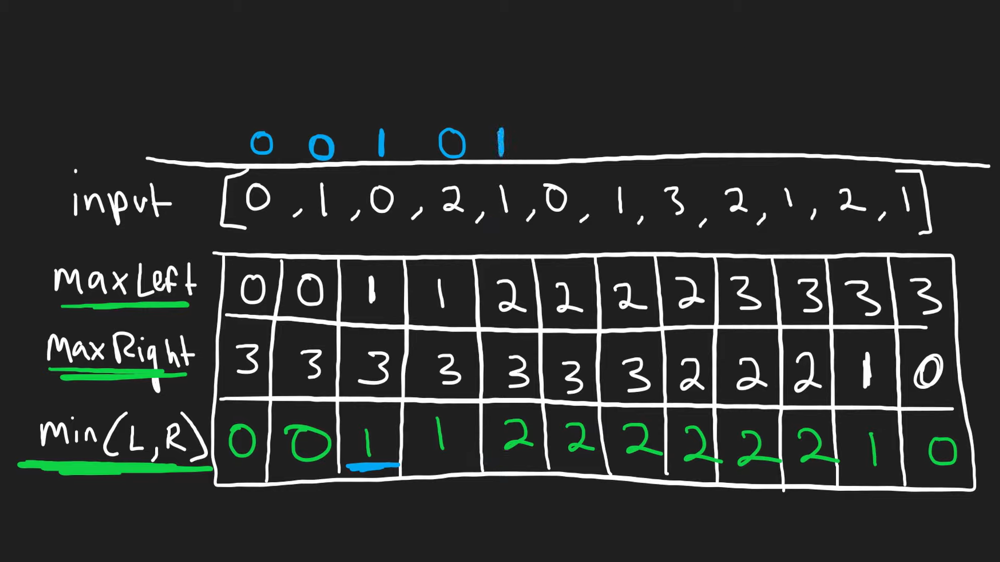

## Minimum array length required to after pair removal

<span style='color:lightgreen;'> Very good question</span>

Input : `nums = [1,3,4,9]`

Output : `0`

[Link to the problem 🍻](https://leetcode.com/problems/minimum-array-length-after-pair-removals/)

Approach :

1. We need to create a map to count the frequency of each element in the array and then store it in a HashMap.
2. Get the element with the maximum frequency.
3. Compare the maximum frequency with n/2

   Because if it is less than the n/2 then it will get cancelled by other half of the array, In the other case where it is greater than n/2 then the remaining elements is equal to maxi - ( n - maxi ) .

   Note in the less than case if the array length is even then all the duplicates of that element will get cancelled where as if array length is odd then there will always exist one element which will not get cancelled so we return 1.

```cpp
public:
    int minLengthAfterRemovals(vector<int>& nums) {
        unordered_map<int,int> mp;
        int n = nums.size();
        for(int i = 0 ; i<nums.size() ; i++){
            mp[nums[i]]++;
        }
        int maxi_ele = -1e9;
        for(auto it : mp){
            maxi_ele  = max(maxi_ele,it.second);
        }
        if(maxi_ele <= n/2){
            if(n%2 == 0){
                return 0;
            }
            else {
                return 1;
            }
        }
        return 2*maxi_ele - n;
    }
};
```

## Beautiful Tower

You will be given an array of maximum possible heights , where each element represents the maximum height possible.
<span style='color:blue;'>Very Intuitive Question</span>
You need to make that a tower height that is beautiful

1. `1<= height[i] <= maxHeight[i]`
2. height should be mountain.
   **Mountain**
3. For all `0 < j <= i`, `heights[j - 1] <= heights[j]`
4. For all `i <= k < n - 1`, `heights[k + 1] <= heights[k]`
   Brute Approach :
   For every possible element we will try to make mountain and check for the maximum sum tower.

```cpp
int makeMount(int index, std::vector<int> &num) {
  int n = num.size();
  long long total_sum = num[index];
  // For left part
  int nextHeight = num[index];
  for (int i = index - 1; i >= 0; i--) {
    int curr = 0;
    if (num[i] > nextHeight) {
      curr = nextHeight;
    } else {
      curr = num[i];
    }
    nextHeight = curr;
    total_sum += curr;
  }
  int prevHeight = num[index];
  for (int i = index + 1; i < n; i++) {
    int curr = 0;
    if (num[i] > prevHeight) {
      curr = prevHeight;
    } else {
      curr = num[i];
    }
    prevHeight = curr;
    total_sum += curr;
  }
  return total_sum;
}
```

This logic will run for each index of the array.
Time complexity : $O(n^2)$ , Space complexity : $O(1)$.

## Minimum Operations to make array empty

<span style='color:red;'>Very easy question but intuitive</span><br>
**Input** `nums = [2,3,3,2,2,4,2,3,4]`<br>
**Output** `4`<br>

> If not able to make the array empty then return -1 <br>

As we need to return the minimum operations then we must start dviding the number by 3 First. <br>

$$count =  ceil \left(  \dfrac{ count  }{ 3 \cdot   \left( 1.0  \right)    }    \right)   $$

This is the formula we will be using for this question. <br>

The only condition where we will not able to make operation is 1.<br>

```cpp
class Solution {
public:
    int minOperations(vector<int>& nums) {
        unordered_map<int,int> mp;
        for(int i = 0 ; i<nums.size() ; i++){
            mp[nums[i]]++;
        }
        int minimum_operations = 0;
        for(auto it : mp){
            if(it.second == 1){
                return -1;
            }
            minimum_operations += ceil(it.second/(3*(1.0)));
        }
        return minimum_operations;
    }
};
```

Time complexity : $O(n)$ , Space Complexity : $O(m)$ , where m is the number of unique element present in the given array.<br>

### Minimum sum of mountain triplet

<span style='color:Tomato'>Medium Level Question</span>

You will be given **0-Indexed** array.<br>
Need to find a triplet which satisfies the condition for (i, j, k): <br>

1. $i<j<k$
2. $nums[i]<nums[j]$ and $nums[j]>nums[k]$

**Approach**:<br>
Calculate the left_min_prefix and right_min_prefix of the given array.<br>

**Code**: <br>

```cpp
int solve(vector<int> &nums){
  int curr_idx = 1;
  int n = nums.size();
  vector<int> left_min(n);
  left_min[0] = nums[0];
  for(int i = 1 ; i<n ; i++){
   left_min[i] = min(left_min[i-1],nums[i]);
  }
  vector<int> right_min(n);
  right_min[n-1] = nums[n-1];
  for(int i = n -2 ; i>=0 ; i--){
    right_min[i] = min(right_min[i+1],nums[i]);
  }
  int mini = 1e9;
 for(int i = 1 ; i<n-1 ; i++){
    if(nums[i] > left_min[i-1] && nums[i] > right_min[i+1]){
      mini = min(mini,nums[i] + left_min[i-1] + right_min[i+1]);
    }
 }
 return mini;
}
```

Time complexity : $O(n+n+n)$, Space complexity : $O(2n).<br>

Taking too much space... 😵‍💫

### Minimum groups to create assignment

<span style='color:tomato'>Very difficult problem</span>

**Conditions** : <br>

1. Divide the array into groups.
2. Each group should contain elements with same value, the difference between no of elements between the no of elements in the groups should not be greater than 1.

**Thinking** : <br>

- Since, grups with each value number are required, so taking a frequency map should be way to go.
- Because of group constraints we can only make group size maximum to the frequency of the minimum element in the given array.

**Approach** : <br>

1. mp &larr; map[el]++.
2. freq &larr; mp.
3. freq &larr; sort(freq).
4. result = 1e9
5. for (i=1 to min(freq)):
6. result = min(result,helper(,freq))
7. return result

<span style='color:Violet;font-weight:bold;'>Helper method</span> :<br>

1. result = 0.
2. for(each f in freq):
3. groups &larr; f/partition-size;
4. remainder &larr; f%partition-size;
5. if remainder > groups
6. return <span style='color:red'>Inf</span>
7. result &larr; result + ceil(f/partition-size+1);
8. end for.
9. return result

**Reason**
$$ceil \left(  \dfrac{ f  }{ partition+1  }    \right)  $$

It takes care of both the case when parition-size + 1 divides frequency & parition-size doesn't divides the frequency.

Time complexity : $O(n+d+dlogd+m*d)$.<br>

- n is the number of elements.
- d is the number of distinct elements.
- m is the minimum frequency of the given frequency map.

Space complexity : $O(n+n)$ &rarr; $O(2n)$ &rarr; $O(n)$.

### 3 sum

<span style='color:Tomato'>Brute Force + Optimal</span>

**Statement** : Find all triplets which adds up to zero.

**Brute Force** :

1. Running a loop for all the triplets possible and checking each.
2. Optimal approach.

For **Naive Approach** : Time complexity : $ O(n^3) $.

**Optimal Approach** :
[3 sum](https://youtu.be/jzZsG8n2R9A)

**Code** :

```cpp
vector<vector<int>> solve(vector<int> &nums) {
  // Sorting the given vector first.
  sort(nums.begin(), nums.end());

  int n = nums.size();
  vector<vector<int>> helper;
  for (int i = 0; i < n; i++) {
    int first = nums[i];
    if (i > 0 && nums[i] == nums[i - 1]) {
      continue;
    }
    int left = i + 1, right = n - 1;
    while (left < right) {
      int sum = first + nums[left] + nums[right];
      if (sum < 0) {
        left++;
      } else if (sum > 0) {
        right--;
      } else {
        helper.push_back({nums[i], nums[left], nums[right]});
        left++;
        while (nums[left] == nums[left - 1] && left < right) {
          left++;
        }
      }
    }
  }

  return helper;
}

```

Time complexity : $ O(nlogn+n^2)$ with constant space.

### Rainwater Trapping

<span style='color:Tomato'>Very hard problem.</span>

**Brute Force Approach** :

- As we know that the amount of water that can be collected in a location is equal to the minimum of the maximum elevation on both right and left side of the current location.
- We can find the minimum of the maximum elevation on both right and left side of the current location.
- Since we are looking for each index, hence the time complexity would be $ O(n^2) $.

**Optimal Approach** :

- Maintaning a left_max , right_max array .

- .

$$ Ans = max \left( maxL \left| maxR \right| \right) -H $$

**Code** :

```cpp
 int trap(vector<int>& heights) {
  int n = heights.size();
  vector<int> left_max(n), right_max(n);
  left_max[0] = heights[0];
  for (int i = 1; i < n; i++) {
    left_max[i] = max(left_max[i - 1], heights[i]);
  }
  right_max[n - 1] = heights[n - 1];
  for (int i = n - 2; i >= 0; i--) {
    right_max[i] = max(right_max[i + 1], heights[i]);
  }
  int final_ans = 0;
  for (int i = 0; i < n; i++) {
    final_ans += min(left_max[i], right_max[i]) - heights[i];
  }
  return final_ans;
}
```

Time complexity : $ O(3n) $ , Space complexity : $ O(2n) $ &rarr; $ O(n) $. <br>

## Frequency of the Most Frequent Element

I/P : `nums = [1,4,8,13], k = 5`  
O/P : `2`

> You have only 5 operations to perform on the given array elements.  
> You can only increase the value of the array elements.

$$ Max \cdot winSize > = Total+k$$

**Max** : The element we are trying to make equal to.  
**Total** : The sum of all the elements in the window.  
**winSize** : the size of the window.

> We need to sort the array first.

**Thinking** :

- First we will sort the given array.
- Take two pointer to represent the window.

**Approach** :

```cpp
int maxFrequency(vector<int>& nums, int k) {
        long long ans = 0;
        long long total = 0;
        sort(nums.begin(),nums.end());
        long long l = 0 , r = 0;
        while(r < nums.size()){
            total += nums[r];
            while(nums[r]*(r-l+1) > total + k){
                total -= nums[l];
                l++;
            }
            ans = max(ans,(r-l+1));
            r++;
        }
        return ans;
    }


```

Time complexity : $O(nlogn)$ , Space complexity is constant.

## Check sorted & rotated array

I/P : `nums = [3,4,5,1,2]`  
O/P : `true`

Explanation : The array is sorted and rotated.

Thinking :

- We need to find any valley point in the array.
- We need to check for valleys with this formula $ nums[i] > nums[(i+1) % n] $, To compare the first element to the last element in the given array.

Approach :

```cpp
bool check(vector<int>& nums) {
        int count = 0 ;
        for(int i = 0 ; i<nums.size() ; i++){
            if(nums[i] > nums[(i+1)%nums.size()]){
                count++;
            }
            if(count > 1) return false;
        }
        return true;
    }
```

Time complexity : $O(n)$ , Space complexity : $O(1)$.

## Rotate the array by K steps

I/P : `nums = [1,2,3,4,5,6,7] , k = 3`

O/P : `[5,6,7,1,2,3,4]`

Brute Approach :

- Store the end k elements in another vector.
- Adding the k elements before the rest of the elements in the given array.

Time complexity : $O(n)$, Space complexity : $O(k)$.

Best Approach :

- find the required rotation we need to do which the formula $ k = k % n $.
- Reverse the array from 0 to k - 1.
- Reverse the array from k to n-1.
- Reverse the entire array.

Approach ::

```cpp
void reverse_arr(vector<int> &arr, int low, int high) {
  while (low <= high) {
    swap(arr[low], arr[high]);
    low++;
    high--;
  }
}

void rotate_by_k(vector<int> &arr, int k) {
  int k_left = arr.size() - k;
  reverse_arr(arr, 0, k_left - 1);
  reverse_arr(arr, k_left, arr.size() - 1);
  reverse(arr.begin(), arr.end());
}
```

Time complexity : $O(n)$ , Space complexity is constant.

## Sort colors

You will be given an array containing only 0's, 1's and 2's.

Input : `nums = [2,0,2,1,1,0]`  
Output : `[0,0,1,1,2,2]`

Brute Approach : Simply sort the given array using any sorting algorithm.

Better Approach : Counting the 0's, 1's and 2's and then filling the array with the count of 0's, 1's and 2's.mid++;

Optimal Approach : Using **Dutch National Flag Algorithm**.

```cpp
 void sortColors(vector<int>& nums) {
        int low = 0 , mid = 0 , high = nums.size() - 1;
        while(mid <= high) {
            if(nums[mid] == 0) {
                swap(nums[mid],nums[low]);
                low++;
                mid++;
            }
            else if(nums[mid] == 1) {
                mid++;
            }
            else {
                swap(nums[mid],nums[high]);
                high--;
            }
        }
    }
```

Time complexity : $O(n)$ , Space complexity is constant.

## Find majority element

I/P : `nums = [3,2,3]`  
O/P : `3`

Brute Force Solution : Using two loops and checking for the majority element.  
if any element count greater than n/2 is found then return that element.-

Code :

```cpp
int majorityElement(vector<int>& nums) {
        int ans = -1;
        for(int i = 0 ; i<nums.size() ; i++){
            int cnt = 0;
            for(int j = 0 ; j<nums.size() ; j++){
                if(nums[j] == nums[i]){
                    cnt++;
                }
                if(cnt > (nums.size()/2)){
                    ans = nums[i];
                    break;
                }
            }
        }
        return ans;
    }
```

Time complexity : $O(n^2)$ , Space complexity is constant.

Better Approach : Using map to store the count of various elements in the array.

Optimal approach : **Boyer Moore Voting Algorithm**

## Kadane's algorithm

Used to find maximum sum sub-array in an given array.

Approach :-

```cpp
int maxSubArray(vector<int>& nums) {
        int curr_sum = 0 , maxi_sum = -1e9  ;
        for(int i = 0 ; i<nums.size() ; i++) {
            curr_sum += nums[i];
             maxi_sum = max(curr_sum, maxi_sum);
            if(curr_sum < 0) {
                curr_sum = 0;
            }

        }
        return maxi_sum;
    }
```

Time complexity : $O(n)$ , Space complexity : $O(1)$.
