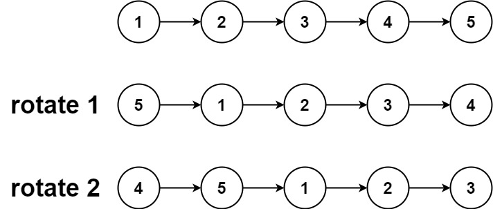
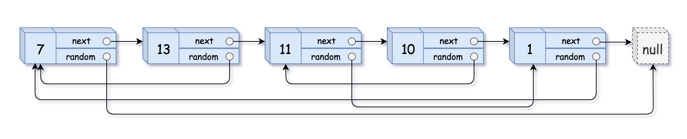

## Detect Cycle in a linked list

Please tell only this approach to the interviewer ok 🙃.

Fast and slow pointer approach.

Algo :

1. Initialize two pointers fast and slow pointer.
2. check for the base condition.
3. Do while loop until fast ≠ NULL
4. move fast as `fast = fast→next→next`.
5. move slow as `slow = slow→next`.
6. if ( slow == fast ) return true;
7. else return false.

Another Cross-Questioning can be done :

Tell the position of the node , due to which cycle is being generated.

Solution :

Its simple just take another pointer and point it to the head of the linked list.

move both the slow and entry pointer simultaneously until they both are equal.

The point where both the slow and entry pointer are equal return that node.

Intuition :

If their exist a cycle eventually both the fast and slow pointer will meet that’s for sure.

Code :

```cpp
ListNode* fast = head;
        ListNode* slow = head;
        if(head == NULL || head->next == NULL){
            return false;
        }
        while(fast!=NULL && fast->next != NULL){
            fast = fast->next->next;
            slow = slow->next;
            if(fast == slow){
                return true;
            }
        }
        return  false;
```

Time Complexity :

$$
O \left( n  \right)   
$$

Space Complexity : Constant Space

## Reverse List in K Groups 🤯

Very Important Question

Solve it using recursion.

> `next = curr→next
curr→next = prev
prev = curr 
curr = next`

Remember the base case :

if the size of the list to be reversed is less then the given k.

```cpp
Node* help(Node* head , int size , int k ){
    if(head == NULL || size < k){
        return head;
    }
    Node* nex = NULL;
    Node* prev = NULL;
    Node* curr = head;
    int count = 0;
    while(curr!=NULL && count<k){
        nex = curr->next;
        curr->next = prev;
        prev = curr;
        curr = nex;
        count++;
    }
        head->next = help(nex,size-k,k);
    return prev;
}

Node* kReverse(Node* head, int k) {
    int size = 0;
    Node* temp = head;
    while(temp!=NULL){
        temp = temp->next;
        size++;
    }
    return help(head,size,k);
}
```

Time Complexity :

$$
O \left( n  \right)  
$$

> Visiting each node only one time.

Space Complexity :

$$
O \left(  \dfrac{ n  }{ k  }   \cdot  k  \right) 
$$

> First n/k is for each recursion stack space . and k is space taken for each reversal time.

## Check Weather linked list is Palindrome or Not

Brute Force :

Using two arrays and storing the traversal and checking.

TC : O(N)

SC : O(N+N)

Better :

1. First use two pointer approach and traverse till fast pointer reach the second last node of the linked list.
2. Then reverse the linked list from slow’s next pointer and move slow pointer to the next node.
3. Take a dummy node and point it to the head of linked list .
4. Now move both the dummy node and the slow pointer one by one and check if the values are equal or not.
5. If any miss match is found then return false.

   This approached reduces the space complexity to constant.

   Time Complexity :

   $$
   O \left(  \dfrac{ n  }{ 2  }  + \dfrac{ n  }{ 2  }  + \dfrac{ n  }{ 2  }    \right)   
   $$

```cpp
if(head == NULL || head->next == NULL){
        return true;
    }
    LinkedListNode<int>* slow = head;
    LinkedListNode<int>* fast = head;
    while(fast->next != NULL && fast->next->next !=NULL){
        fast = fast->next->next;
        slow = slow->next;
    }
    slow->next = reverseLL(slow->next);
    slow = slow->next;
    LinkedListNode<int>* DummyNode = head;
    while(slow!=NULL){
        if(DummyNode->data != slow->data){
            return false;
        }
        DummyNode=DummyNode->next;
        slow = slow->next;
    }

    return true;
```

👆 is the best approach to solve this.

## Flatten a Linked List

Very IMPORTANT Question.

I/O

O/P :


Algo :

- We will merge two linked list l1 and l2 until the current→next and current pointer becomes NULL.
- Merge Function will merge two linked list using the bottom pointer.

```cpp
Node* merge(Node* a, Node* b){
	Node* temp = new Node(0);
	Node* res = temp;
	while(a!=NULL && b!=NULL){
		if(a->data < b->data){
			temp->child = a;
			temp = temp->child;
			a = a->child;
		}
		else {
			temp->child = b;
			temp = temp->child;
			b = b->child;
		}
	}
	if(a!=NULL) {
		temp->child = a;
	}
	else{
		temp->child = b;
	}
	return res->child;
}

Node* flattenLinkedList(Node* head)
{
	Node* current = head; // Maintain a separate pointer
    while(current && current->next){
        Node* temp = current->next->next;
        current = merge(current, current->next);
        current->next = temp;
    }
    return current;
}
```

Time Complexity :

$$
O \left( n \cdot  k  \right) 
$$

> You can also say this O(total number of nodes).

Space Complexity :

$$
O \left( 1  \right)   
$$

## Swap nodes in pairs

Input : `head = [1,2,3,4]`
Output : `[2,1,4,3]`
Approach :

```cpp
ListNode* swapPairs(ListNode* head) {
        ListNode* newNode = new ListNode(0); // Creating an entire linked list
        newNode->next = head; // making it point to the head of the given ll
        ListNode* temp = newNode; // Taking another pointer making to point to same head
        while(temp->next != NULL && temp->next->next != NULL){ // condition for traversal
            ListNode* s1 = temp->next;
            ListNode* s2 = temp->next->next;
            s1->next = s2->next; // Main swap logic
            s2->next = s1;
            temp->next = s2; // To connec the main linked list chain with the swapped one pairs
            temp = s1; // apparently we are trying to move the temp value because after swapping s1 pointer will be ahead of s2 pointer.
        }
        return newNode->next;
    }
```

Time complexity : $O(n)$ , Space complexity : $O(1)$.
Recursive Approach:

```cpp
ListNode* swapPairs(ListNode* head) {
       if(head == NULL || head->next == NULL){
           return head;
       }
        ListNode* first = head;
        ListNode* second = head->next;
        first->next = swapPairs(second->next);
        second->next = first;
        return second;
    }
```

Time complexity : $O(n)$ , Space complexity : $O(n)$ , which is recursion stack space.

## Rotate List



<span style='color:Tomato'>Medium Level Problem</span>

**Thinking** : <br>

- Mainly their two cases $ K >= n $ or $ K < n $.
- if $ K >= n $ then we need do $ K\%n $ to get the final rotation required.
- Making the linked list circular linked list, while calcualating the size of the linked list.

**Approach** : <br>

```cpp
ListNode* rotateRight(ListNode* head, int k) {
        if(head == NULL || head->next == NULL) return head;
        auto currr = getSize(head);
        int size = currr.first;
        ListNode* curr = currr.second;
        k = k % size;
        k = size - k ;
        while(k!=0){
            curr = curr->next;
            k--;
        }
        head = curr->next;
        curr->next = NULL;
        return head;
    }
```

Time complexity : $ O(n+n) $.

### Deep Copy



<span style='color:Tomato'>Random Pointer</span> is pointing to any node in the given linked list even null.

**Thinking** : <br>
We can hash old node address to new node address 🤔.

**Approach** : <br>

```cpp
Node* copyRandomList(Node* head) {
        if(head == NULL) return head;
        Node* temp1 = head;
        Node* dummyNode = new Node(0);
        Node* temp2 = dummyNode;
        unordered_map<Node*,Node*> mp;
        while(temp1 != NULL){
            Node* newNode = new Node(temp1->val);
            mp.insert({temp1,newNode});
            temp2->next = newNode;
            temp2 = temp2->next;
            temp1 = temp1->next;
        }
        temp1 = head;
        temp2  = dummyNode->next;
        while(temp1 != NULL){
            Node* random_ptr = temp1->random;
            Node* newNode = mp[random_ptr];
            temp2->random = newNode;
            temp2=temp2->next;
            temp1=temp1->next;
        }
        return dummyNode->next;
    }
```

Time complexity : $ O(n + n) $ , Space complexity : $ O(n) $ , for mapping the addresses.
