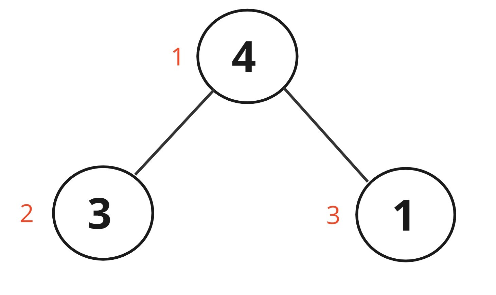

## Preorder traversal

Root → Left → Right
We can also solve this traversal using recursion but it will take recursion stack space.
Approach using stack :

```cpp
vector<int> ans;
        if(root == NULL){ // to handle the case if only one null node is given
            return ans;
        }
        stack<TreeNode*> st;
        st.push(root);

        while(!st.empty()){
            TreeNode* node = st.top();
            st.pop();
            ans.push_back(node->val);
            if(node->right){
                st.push(node->right);
            }
            if(node->left){
                st.push(node->left);
            }
        }
        return ans;
```

Time complexity : $O(n)$ , Space complexity : $O(n)$ i.e. is the stack space we are using.

## Post-order traversal

Left → Right → Root
Basic approach should me the recursion approach.
Stack approach :

```cpp
vector<int> ans;
        if(root == NULL){
            return ans;
        }
        TreeNode* curr = root;
        stack<TreeNode*> st;
        TreeNode* temp = NULL;
        while(curr!=NULL || !st.empty()){
            if(curr!=NULL){
                st.push(curr);
                curr = curr->left;
            }
            else {
                temp = st.top()->right;
                if(temp == NULL){
                    temp = st.top();
                    st.pop();
                    ans.push_back(temp->val);
                    while(!st.empty() && temp == st.top()->right){
                        temp = st.top();
                        st.pop();
                        ans.push_back(temp->val);
                    }
              }
              else {
                  curr = temp;
              }
            }
        }
        return ans;
```

Time complexity : $O(2n)$ , first n for inserting the element in the stack then second n for check each and every element one by one , Space complexity : $O(n)$ , for the single stack we are using.

## Left view of binary tree

I/P :
_`4`_
_`/   \`_
_`5     2`_
_`/   \`_
_`3     1`_
_`/  \`_
_`6    7`_
O/P :
`4 5 3 6`
We need to move in the order :
Root → Left → Right
Approach :

1. if the root is null then return
2. if level is equal to the data structure size ( in which the answer is stored ) , we add the node into our answer , because it is the first node encountered while traversing each level.
3. Call for the left tree with level = level + 1
4. Call for the right tree with level = level + 1

```cpp
void help(Node *root , int level , vector<int> &ds){
    if(root == NULL) return;
    if(ds.size() == level) { // we need to add the first element in the array for each level
        ds.push_back(root->data);
    }
        help(root->left , level + 1 , ds);
        help(root->right,level+1,ds);
}
```

Time complexity : $O(N)$ , Space complexity : $O(H)$ , where H is the height of the tree.

## Find the ceil

You will be given a full binary tree and key , you need to find a node whose value is equivalent to $key$ or $key+1$.
<span style='color:yellow;'>Tried recursion didn't work 😪</span>
Approach :

```cpp
int findCeil(BinaryTreeNode<int> *node, int x){
    int ceil = -1;
    while(node){
        if(node->data == x ){
            ceil = node->data;
            return ceil;
        }
         if(node->data < x){
            node = node->right;
        }
        else {
            ceil = node->data;
            node = node->left;
        }
    }
    return ceil;
}
```

Time complexity : $O(H)$ where H is the maximum height of the tree.
What would be the worst case for the above algorithm 🧐?
<span style='font-weight:bold;color:lightgreen;'>Skew Tree</span>

## Morris inorder traversal

It is the same inorder traversal as the inorder traversal.
But the space complexity for this inorder traversal is $O(1)$.
<span style='color:red;'>Very Intiutive</span>😫.
Because we use threaded binary tree.
we connect a thread back to its last root , so that we need not to use any stack or recursion to remember it when we need to head back to the previous root node.
**Algorithm**

```cpp
 vector<int> inorderTraversal(TreeNode* root) {
        TreeNode* curr = root;
        vector<int> ans;
        while(curr != NULL){
            if(curr->left == NULL){
                ans.push_back(curr->val);
                curr = curr->right;
            }
            else {
                TreeNode* prev = curr->left;
                while(prev->right && prev->right != curr){ // Running for atmost O(n)
                    prev = prev->right;
                }
                if(prev->right == NULL){
                    prev->right = curr;
                    curr=curr->left;
                }
                else {
                    prev->right = NULL;
                    ans.push_back(curr->val);
                    curr=curr->right;

                }
            }
        }
        return ans;
    }
```

Time complexity $O(n+n)$, Space complexity : $O(1)$ 🥳.

### Symmetric tree

<span style='color:MediumSeaGreen'>Easy + recursive</span>


We need to return either true or false.

**Base conditions** :

- if left == NULL or right == NULL
  - return left == right
- if left->val == right->val
  - return true

**Approach** :

```cpp
bool help(TreeNode* root1 , TreeNode* root2){
        if(root1 == NULL || root2 == NULL){
            return root1 == root2;
        }
        if(root1->val != root2->val) return false;
        return help(root1->left,root2->right) && help(root1->right,root2->left);
    }
```

Time compelxity : $O(n)$.

#### Children Sum property

<span style='color:MediumSeaGreen'>Easy + recursive</span>



**Base Case** :

- if root == NULL or ( root->left == NULL && root->right == NULL)
- return true

**Approach** :

```cpp
 int left_sum = 0 , right_sum = 0;
    if(root->left!=NULL ){
        left_sum = root->left->data;
    }
    if(root->right!=NULL){
        right_sum = root->right->data;
    }
   if(root->data == (left_sum + right_sum) && isParentSum(root->left) && isParentSum(root->right)){
       return true;
   }
   else {
       return false;
   }
```

Time complexity : $O(n)$.

### Populating next pointer

**Question** :


<span style='color:Tomato'>level-order traversal</span>

All the next pointers will be null initiallay.

**Thinking** : The next pointer will point to the immediate next element in the
subarray formed in the level order traversal.

**Approach** :

```cpp
Node* connect(Node* root) {
        queue<Node*> q;
        q.push(root);
        if(root == NULL){
            return root;
        }
        while(!q.empty()){
            int size = q.size();
            if(size == 0){
                return root;
            }
            while(size > 0 ){
                Node* temp;
                if(size > 1){
                    temp = q.front();
                    q.pop();
                    Node* nextNode = q.front();
                    temp->next = nextNode;
                }
                else {
                    temp = q.front();
                    q.pop();
                }
                if(temp->left != NULL){
                    q.push(temp->left);
                }
                if(temp->right !=NULL){
                    q.push(temp->right);
                }
                size--;
            }
        }
        return root;
    }
```

Time complexity : $O(n)$ , Space complexity : $O(w)$ ,
where w is the number of leaf nodes.

### Create BST from Sorted array

<span style='color:SlateBlue'>Recursive + Basic Logic</span>

**Thinking** :

- Since we are given sorted array, so the middle
  element of the array will always be our root element.
- We will find the middle element from the array
  reduce the window like we do in merge sort.

**Approach** :

```cpp
TreeNode* help(int L , int R , vector<int>& nums){
        if(L>R){
            return NULL;
        }
        int mid = (L+R)/2;
        TreeNode* root = new TreeNode(nums[mid]);
        root->left = help(L,mid-1,nums);
        root->right = help(mid+1,R,nums);
        return root;
    }
```

Time complexity : $O(n)$ , Space complexity : $O(n)$
