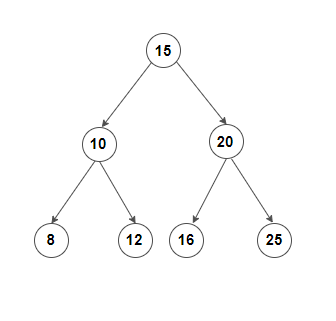

# Trees 2

## Predecessor order & Successor

**Predecessor** : The _just_ smallest value that  
 is present in the inorder tree traversal.

**Successor** : The _just_ greater value that is present in
the inorder of a tree traversal.

### Find the inorder_Predecessor & inorder Successor

Input :
<br>
`key = 10`

Output : `{8,12}`

**Brute Thinking** :

- First get the inorder of the entire tree.
- Return the just greater element from the key for
  successor and return the just smaller element from the key
  for predecessor.<br>

Time complexity : $O(n+nlogn)$, Space complexity : $O(n)$.

**Optimal** :

1. For Predecessor :
   ```cpp
   int pre = -1;
   while(root != NULL){
       if(root->val >= key){
           root = root->left;
       }
       else{
           root=root->right;
           pre = root->val;
       }
   }
   return pre;
   ```
2. For Successor :
   ```cpp
    int suc = -1;
    while(root != NULL){
        if(root->val > key){
            suc = root->val;
            root = root->left;
        }
        else {
            root = root-> right;
        }
    }
    return suc;
   ```
   Time complexity : $O(H)$ , where H is the height of the tree.
