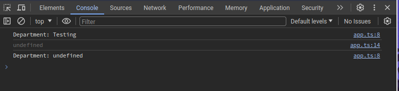

# Typescript

A javascript superset .

It was created by microsoft

Add new features and advantages to normal javascript.

| Static Language                                | Dynamic Language                                      |
| ---------------------------------------------- | ----------------------------------------------------- |
| Variables are defined within a domain.         | Variables are not defined within a particular domain. |
| Type of variables is known at the compile time | Type of variable is determined at the runtime.        |

Browser’s can’t execute it .

Adds types .

It is static in nature

> Means → we declare the type of variable during development .

### Advantages

Non-javascript features like generics .

Rich configuration options.

Decorators support .

## Core Types

1. **number** : All numbers , no differentiation between integers and floats.
2. **string** : All text values.
3. **boolean** : you know very well.
4. **object :** Any javascript object , more specific types are possible.
5. **array** : Same as javascript arrays.
6. **Tuple** : Fixed-length & type array.
7. Enums : Enumerated global constant identifiers.
8. **Any** : Any kind of value , no specific assignment .
9. Never : **Represents a value which is never observed** i.e that function either throws an error or a exception instead of returning .

### Syntax :

**`variable_name : datatype`**

### Syntax for assigning types to object :

`const ob_name : {`

`variable_name : datatype,`

`variale_name2 : datatype`

`} =`

### Syntax for assigning types to array :

`hobbies: Array<string>;`

`let favoriteItems: datatype[];`

### Tuples in Typescript

```jsx
role: [string, number];
```

### Enums in Typescript

```jsx
enum name {
  ADMIN = 'admin',
  READ_ONLY = 3,
  AUTHOR,
}
```

## Union types in typescript

When we want a variable to hold more than core data type then we use union types .

**Syntax** :

```jsx
	input1 : number | stirng | boolean | ......
```

## Literal types

Have the ability to expand into many strings via unions.

Syntax :

```tsx
resultConversion: "as-number" | "as-text" | ".." | ...
```

## Custom Alias

Used when you have multiple union data types for the particular variable .

Allow use to save extra code.

Syntax :

```tsx
type inputType = number | string;
```

### Return type for function

Syntax :

```tsx
function Add(input1: number, input2: number): string {
  return input1 + input2;
}
// we can also write void instead of string if the function is not returning anything .
```

## Function Type

When we want to assign a function to a variable .

Syntax :

```tsx
let combineValues: (input1: number, input2: number) => number;
```

### Passing Function Type as callback functions

```tsx
function addHandler(
  number1: number,
  number2: number,
  cb: (num: number) => number,
) {
  return number1 * number2;
}
```

### TS Configuration

`tsc init`

This command will create a tsconfig.json.

**tsconfig.json** contains all the information about the project .

This tells typescript how to compile the typescript files of the current project.

**Options :**

`“exclude”` : [ “….ts” ] ( wants an array of files which need to excluded from compiling when we run tsc ) .

`“include”` : [””] ( wants an array of files name which need to included for compilation.

`“files”` : wants a file to be included for compilation.

`“sourceMap”` : creates a link between the typescript and javascript files ( both the files will be visible in our browser in the Sources section and will add [js.map](http://js.map) file of each javascript file).

`“outDir”` : specify where the compiled javascript files will be stored.

`“rootDir”` : specify the directory containing the typescript files.

> The main difference between var and let is that let is block specific whereas var is not .

> When you are defining default argument put them on the right hand side of the augment list.

### Rest Parameters

Means that you can pass multiple characters into parameters of a function .

Syntax :

```tsx
...numbers: number[]
```

## Destructuring

> Extracting some specific value from the array or objects.

```tsx
const [hobby1, hobby2, ...remaining] = hobbies;
```

👆 hobby1 will be the first element of the hobbies array  
 hobby2 will be the second element of the hobbies array.

remaining will be the containing all the remaining array element from the hobbies array.

> In array destructuring the order of the variables matters, but where as the case of object destructuring the key-name matters the most.

```tsx
const person = {
  fullName: "Burgir",
  age: 21,
};

const { fullName, age } = person;
```

👆This is how we destructure an object.

## Combining two type

We can combine two type object or variables using & operator.

The data type of the resultant object or variable with be of intersection type.

```tsx
type Admin = {
  name: string;
  preivileges: string[];
};

type Employee = {
  name: string;
  startDate: Date;
};

type ElevatedEmployee = Admin & Employee;

const e1: ElevatedEmployee = {
  name: "Pratham",
  privileges: ["can do anything", "can do 7 pull ups"],
  startDate: new Date(),
};
```

## Type-Guard in Typescript

A technique in typescript that is used to get the information about the type of the a variable , usually within the conditional block .

We use inbuilt operators like `typeof , instanceof , in` operator

```tsx
function StudentId(x: string | number) {
  if (typeof x == "string") {
    console.log("Student");
  } else {
    console.log("Id");
  }
}

class Car {
  drive() {
    console.log("Driving car.....");
  }
}

class Truck {
  drive() {
    console.log("Driving Truck ...");
  }

  loadCargo(amount: Number) {
    console.log("Loading cargo.. " + amount);
  }
}

type Vehicle = Car | Truck;

const v1 = new Car();
const v2 = new Truck();

function useVehicle(vehicle: Vehicle) {
  vehicle.drive();
  if (vehicle instanceof Truck) {
    vehicle.loadCargo(34);
  }
}
```

### Discriminated Union

When we have a common field in both multiple interface .

```tsx
interface bird {
  type: "bird";
  flyingSpeed: number;
}
interface horse {
  type: "horse";
  runningSpeed: number;
}

type Animal = bird | horse;

function moveAnimal(animal: Animal) {
  let speed;
  switch (animal.type) {
    case "bird":
      speed = animal.flyingSpeed;
      break;

    case "horse":
      speed = animal.runningSpeed;
  }
  console.log("Moving at a speed of : " + speed);
}
```

## Type Casting

Specifying the type of the data that will be stored in the variable.

```tsx
const userInput = document.getElementById("user-input") as HTMLInputElement;
 --- Other Way
const userInput = <HTMLInputElement>document.getElementById('user-input');
```

## Index Properties

When we want to add flexibility to a object about what its holds .

```tsx
interface ErrorContainer {
  [prop: string]: string; // property must have a string name and a value which should be string
}
```

Useful when you don’t know how properties the type or interface may have.

## Function overloads

You can have multiple functions with same name but different parameter type ( The number of parameters should be the same ) .

Specify what the function will return for a specific parameters passed in the function arguments .

```tsx
function add(a: number, b: string): string;
function add(a: string, b: string): string;
function add(a: number, b: number): number;
function add(a: Combinable, b: Combinable) {
  if (typeof a == "string" || typeof b == "string") {
    return a.toString() + b.toString();
  } else {
    return a + b;
  }
}
```

```tsx
const randomObject = {
  name : 'Akinso',
  id : 'he',
  // job : { title : 'CTO' , desc : 'Good Employee'}
}
console.log(randomObject?.job?.title?)
```

Here we are un sure about the randomObject will contains a job field , so we insert ? at the end .

### Optional chaining

it is the feature provided in typescript which provide convenient access to the properties and method without the need to explicit null or undefined checks.

Denoted by :

`?`

### Nullish coalescing

This feature is used to handle the undefined and null values of a variable , by using the value defined on the right side of the ?? operator as default value .

Denoted by :

`??`

### Generic type

Generic type allows us to create reusable and type-safe components

Enables to write code that maintains the type
of the information while remaining flexible and adaptable.

Syntax :

`const names: Array<string> = ["Pratham", "Sanajana"];`

Syntax for generic functions

`function merge<T extends object, U extends object>(Obj1: T, Obj2: U) {
return Object.assign(Obj1, Obj2);
     }`

Here we are specifying that Obj1 is an object
of type T , Obj2 is an object of type U and function is returning the intersection of type T & U.

### Generic function

These functions allows us to work with multiple
datatypes while maintaining the type safety.

Allows to write functions that are flexible and reusable.

Example :

```tsx
function identity<T>(arg: T): T {
  return arg;
}
```

### Constraints

The `extends` keyword put a constraint of the what the generic type can accept.

```tsx
function processArray<T extends number>(arr: T[]): number {
  let sum = 0;
  for (const item of arr) {
    sum += item;
  }
  return sum;
}
```

Here T is a generic type that is constraint to extend
a number , array accepts an array of generic type T and return a number .

### Keyof constraint

Allows us to create generic types that are constrained
to accept keys of a specific object type.

```tsx
function extractAndConvert<T extends object, U extends keyof T>(
  obj: T,
  key: U,
) {
  return "Value of " + obj[key];
}

console.log({}, "prakhar");
```

Here we are specifying key as a generic key for the object
of type T which is obj .

### Generic class

When we want to make a class that work only one
a specific data types , while maintaining the type safety .

```tsx
class DataStorage<T> {
  private data: T[] = [];
  addItem(item: T) {
    this.data.push(item);
  }
  removeItem(item: T) {
    this.data.slice(this.data.indexOf(item), 1);
  }
  getItems() {
    return [...this.data];
  }
}

const textStorage = new DataStorage<string>();
textStorage.addItem("Pratham");
```

### Partial type

when we declare something like this Partial then this makes all
properties of T optional.

This is useful when you want to create an object of similar
type but with some optional properties.

> Use the generic type when you want to lock in a data type in a class or a function.

## Decorators

It is a feature in typescript that allows us to add
metadata or behavior to classes , properties or parameters .

Allows us to change the behavior of the code without changing the actual code.

Syntax :

`@decoratorName`

Decorators run when the class is defined not when it is executed.

```tsx
function WithTemplate(template: string, hookId: string) {
  return function (constructor: any) {
    const hookEl = document.getElementById(hookId);
    const p = new constructor();
    if (hookEl) {
      hookEl.innerHTML = template;
      hookEl.querySelector("h2")!.textContent = p.name;
    }
  };
}
// @Logger("LOGGING - PERSON")
@WithTemplate("<h2>Hello Jij I am done with you</h2>", "app")
class Person {
  name = "Max";

  constructor() {
    console.log("Creating person Object");
  }
}
```

Here constructor represents the constructor function of the class
that is being created .

> Note , it doesn’t have to be named constructor you can use any name you want.

In case of multiple decorators we execute the decorators in a bottom up approach.

```tsx
function Log2(target: any, name: string, descriptor: PropertyDescriptor) {
  console.log("Accessor decorator");
  console.log(target);
  console.log(name);
  console.log(descriptor);
}
```

Here target refers to the parent class , name is the name of the
function , descriptor is the actual function itself.

Return values on the class properties and parameters
is not supported in typescript.

`const importNode = document.importNode(this.templateElement.content,true);`

In the above code snippet the importNode is being used
to import the content of the template , including
all the child nodes in the document ,
The second argument in this method is the copy mode :

If true :

All the child nodes also gets copied to the template element.

else :

Only the parent element is copied to the template element.

`this.hostElement.insertAdjacentElement('afterbegin',this.element)`

In this insertAdjacentElemet method insert the ‘this.element’
into another ‘this.hostElement’ at a specific position .

The first argument specifies the relative location of the element
to be inserted , here afterbegin means that this element will be inserted at the first sub-child of the given host element.

> To check weather a variable is array or tuple we can use
> `Array.isArray(variable)` method.

## Drag Event

This type has a property called `event.dataTransfer`.

It is used to change the data from any drag event on the DOM.

`event.dataTransfer!.setData('text/plain' , [this.project.id](http://this.project.id/))`

The above code is a snippet that is used to set the data in a drag event.

`event.dataTransfer!.effectAllowed = "move";`

To specify the effect that is allowed for a drag operation.

A string representing the drag operation that is allowed.

### Splitting code into multiple files

Namespace approach :

It is the way to organize code containers
to prevent name conflicts, They are similar to modules in typescript.

`namespace MyNamespace {
   export function someFunction() {
     // ...
   }
}`

Not only function you can export anything you want.

In typescript we can use `/// <reference path=’name.ts’ />` to import other typescript files in the current typescript file.

> Group import are
> `import * as hello from ‘file.ts’` where various items can be accessed as hello.exportname.

If you want to add a , in typescript react code then do it like this:

```tsx
const func = () => {
  return <div>you&apos;re free</div>;
};
```

> In react native we can use **KeyboardTypeOptions** to dynamically change the style of Keyboard.

```tsx
interface Props {
  label: string;
  inputType: KeyboardTypeOptions;
}
```

**ViewStyle** type definition is for React native StyleSheet properties.

#### To send the TextInput properties dynamically

We can use the **TextInputProps** type definition present in react-native.
`InputConfig: TextInputProps;`

Add to the TextInput like :
`{...InputConfig}`

#### Handle InputElement

```tsx
const handlePasswordChange = (e: ChangeEvent<HTMLInputElement>) => {
  setPassword(e.target.value);
};
```

> **ChangeEvent** must be imported from react.

## Let vs const

**let** : Any variable created with let keyword can be redefined to any other value.  
**const** : Any variable created with const keyword can not be refined/changed any time, it is a only default value of a particular variable.  
**var** : Any variable created using var only has function or global scope similar to the let variable.

> let allows you to create variables that are limited to scope of a block statement , or expression on which it is used.

_In general we should use let over var._

## Arrow functions

`const printOutput = (output: string | number) => console.log(output);`

or

`const printOutput: (a: number | string) => void = (output) =>
  console.log(output);`

## Default parameter

When we want to assign a default value to a parameter of a function we use default parameters.

```tsx
const add = (a: number, b: number = 1) => {
  return a + b;
};
```

**while passing the parameters to the function order matters the most**  
👆 we cannot do this :

```tsx
const add = (a: number = 1, b: number) => {
  return a + b;
};

// and call it like this
add(2);
```

This will give error because the default parameter should be at the end of the parameter list.

## Spread Operator

`...`

- This is the spread operator in typescript , it is used to spread the elements of an array or object.

```tsx
const hobbies = ["Sports", "Cooking"];

const activeHobbies = ["Gaming"];

activeHobbies.push(...hobbies);
console.log(activeHobbies);
```

## Rest parameter

When the number of parameters are not known or can very then we use the rest parameters.

```tsx
const add = (...numbers: number[]) => {
  return numbers.reduce((curResult, curValue) => {
    return curResult + curValue;
  }, 0);
};

console.log(add(5, 10, 2, 3.7));
```

## Constructor function

It is a special method which is created when ever an object is created for that particular class.

_Constructor_ is a special keyword defined in typescript.

```tsx
class Department {
  name: string;
  constructor(n: string) {
    this.name = n;
  }
}

const testing = new Department("Testing");
console.log(testing);
```

**this** keyword refers to the current object that is created in a class.

```tsx
const hello = { describe: testing.describe };

hello.describe();
```

This will given an undefined in the console log statement because the this keyword will refer to the hello object which does not have the name property.



To avoid this type of error during the runtime we can define the describe function like this :

```tsx
 describe(this: Department) {
    console.log("Department: " + this.name);
  }
```

👇 This means that the describe function will always be called on a object of type Department.

> when we are including the script tag to link our javascript file we add a argument _defer_ to make sure that DOM is loaded on the web-browser before loading the actual script file.

_In javascript array.unshift is method which is used to insert an element at the beginning of the array_.

`let strictArray: [string, number, boolean] = ["Pratham", 2, false];`

☝️ We can also add this index strictness to the arrays as well.

**The main difference between interface and types in typescript is** :

Interface can inherit from other interfaces were as type are not supposed to do that.

Use types most of the time unless u need a functionality like extending.

**readonly** : This keyword is used to make a variable only readable not editable.

To assign data types to the object keys when can do 👇

```tsx
interface transactionObj {
  [index: string]: number;
}
```

**Keyof** : This operator takes object as type and produces an union of all the keys in that object.

### Utility types

**Partial Type `Partial<Type>`** : Constructs a type with all properties of Type set to optional. This utility will return a type that represents all subsets of given type.

**Required Type `Required<Type>`** : Constructs a type consisting all the properties of Type set to required.

**Record Type `Record<Keys,Type>`** : Constructs a type with a set of property keys are of type _Keys_ and Values are of type _Type_.

**Pick Type `Pick<Type,Keys>`** : Constructs a type with limited number of keys specified in the keys.  
**Pick Type `Omit<Type,Keys>`** : Constructs a type by excluding the specified keys from the type.
