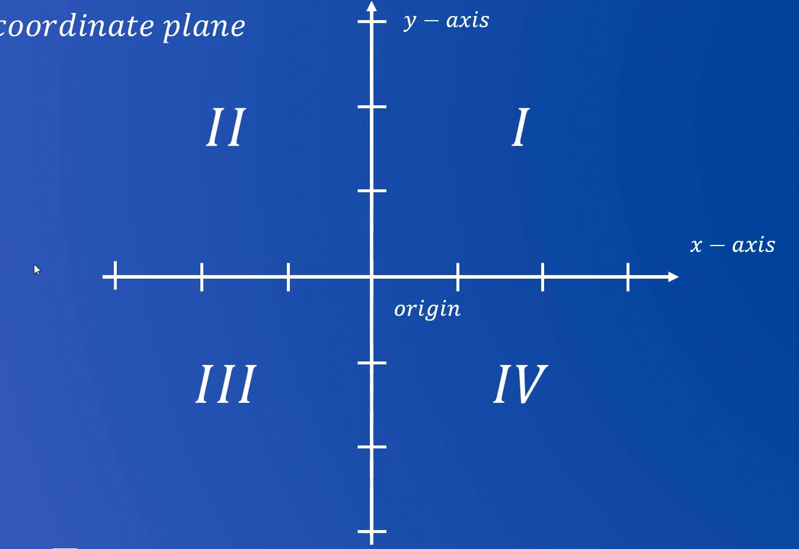

# Coordinate geometry

**X-axis** : The horizontal line.  
**Y-axis** : The vertical line.

The point where the X-axis and Y-axis meet is called **origin**.

**Quadrants** :  
We divide the plane into four parts called quadrants.

- First quadrant : x > 0, y > 0
- Second quadrant : x < 0, y > 0
- Third quadrant : x < 0, y < 0
- Fourth quadrant : x > 0, y < 0

When we are dealing with coordinate geometry we are always dealing with rational numbers in terms of GRE.

**Slope of the line** :  
$$ Slope = \dfrac{ { y }_{ 2 } - { y }_{ 1 } }{ { x }_{ 2 } - { x }_{ 1 } } $$

When the slope is equal to 1 then the line make an angle of 45% degrees with the X-axis.

Slope of a line which is parallel to the x-axis is 0.

Slope of a line which is parallel to the y-axis is undefined.

$$ y = mx+c $$

If any equation is not in the this form then we need to change it to 🔼 form of equation.

**m** is the slope of the equation.  
**c** is the y-intercept of the equation ( It indicates where the line crosses the y-axis).

> Slope of the line is always constant.

> When the line is going down and right then its slope is negative.  
> When the line raises from left to right then its slope is positive.

**If the two lines does do cross each other then their is no solution.**.

### Circle equation

The circle equation in coordinate geometry is given as :

$$ { x }^{ 2 } + { y }^{ 2 } = 9$$.

### Parabola equation

The parabola equation in coordinate geometry is given as :

$$ y = { x }^{ 2 } $$.

$$ y = { \left(x+1 \right) }^{ 2 } $$

The bottom point of the parabola is shifted towards left by 1 unit on the x-axis.

$$ y = { \left(x-1 \right) }^{ 2 } $$

The bottom point of the parabola is shifted towards right by 1 unit on the x-axis.

**To get the line of an equation symmetrical to the y-axis then it should be an even function** :

Which can by check if all the exponent of the equation are even then it will be parallel to the y-axis, else it would be called an odd function.

**Even Function** :

$f(x) = f(-x)$  
exponents are even.

**Odd function** :

$f(x) = -f(-x)$  
exponents are odd.
