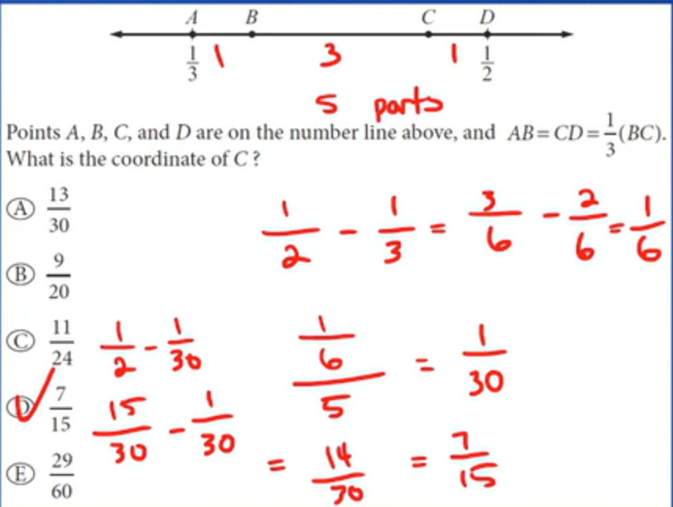
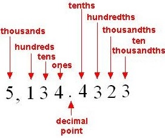
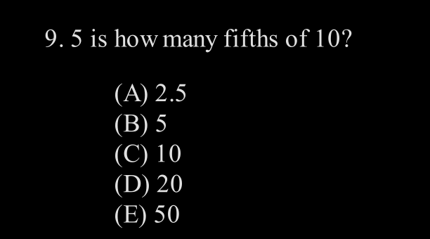
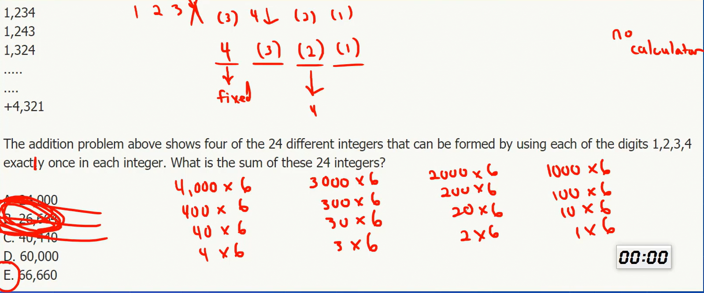

# Fractions, Decimals, Percents, Ratios

## Fractions

Fraction = numerator/denominator.

In a fraction where numerator is greater than denominator is called improper fraction and it can be converted to a mixed fraction.

Factions can be negative.

> Numerator and denominator can only be integers.

By simplifying the fraction we meant to remove the common factors between numerator and denominator.

## Decimals

Repeating decimals can be rationals $\frac{8}{11}=0.\overline{72}$.

## Percents

Percent means "parts per hundred" or "hundredths".

**Example** : 35% means that 35 parts per hundred , 200% means that there are 200 parts per hundred.

> 26% of 50 = 50% of 26.

**Percent Change** : $\frac{New - Old}{Old}$.

## Ratios

The ratio of one quantity to another express their relative sizes.

**Fractions are usually written as part over whole**.  
**Rations are usually written as part over part**.

> The only way to get terminating decimal is that you **have** only _2's or 5's_ in the denominator.

