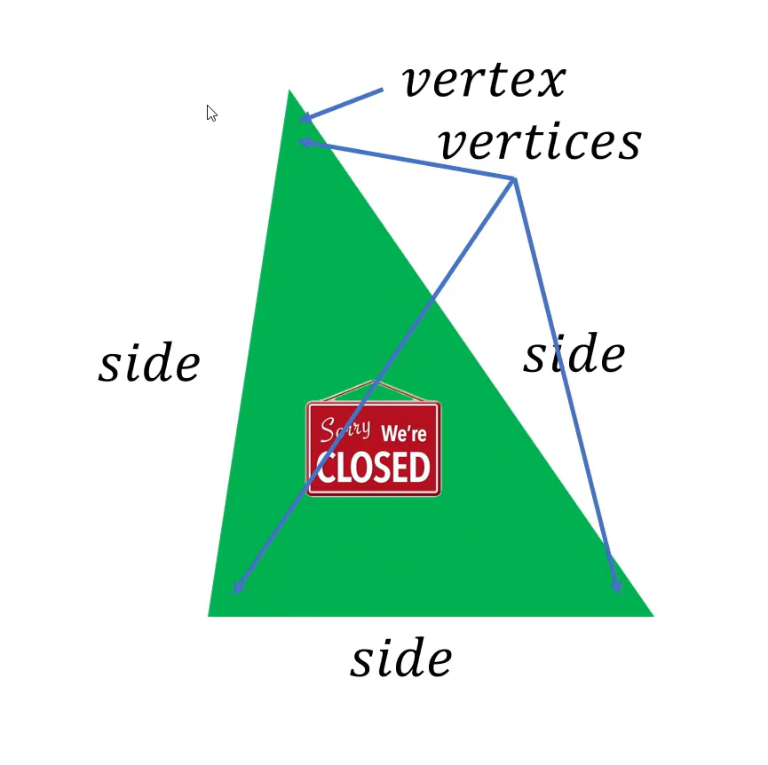

# Lines & Angles

_line_ : A line is a straight path that extends infinitely in opposite directions.

> line has no distance

_line segment_ : A line segment is a part of line that has two endpoints and a definite length which cannot be extended infinitely.

> if two line segments have the same length we have congruent line segments.

When two lines intersect, they form two pairs of opposite angles, called vertical angles. Vertical angles are congruent.

When two perpendicular lines intersect they form an vertical angles which are equal to 90 degrees.

## Angeles

1. Acute Angle: An angle whose measure is less than 90 degrees but greater than 0 degrees.
2. Obstuse Angle: An angle whose measure is greater than 90 degrees but less than 180 degrees.

Two lines with same slope are parallel lines.

If the slope is negative and reciprocal of the slope then the lines are perpendicular to each other.

# Polygons

Examples : triangle , quadrilateral, pentagon, hexagon, heptagon, octagon, nonagon, decagon.

Formula for Degrees of a polygon :

$$ \left( n-2 \right) \cdot 180$$

There are two kinds of polygons:

1. regular : all the sides have same length.
2. irregular : obviously not regular.
