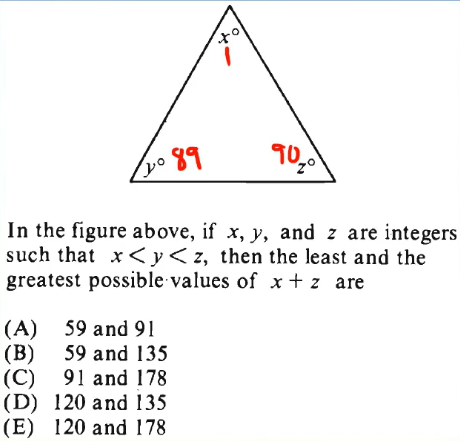

# Arithmetic

## Integers & Primes

O is also an integer.

0 is neither negative nor positive.

**Even** : can split the number and get another integer.  
**Odd** : if we split the number in half , we just kill an integer.

0 is even number.

> The correct option would be 'C'.

### Primes

When we divide an prime number we get another integer when we divisor are 1 and itself.

**Prime number from 1 - 50** :

2, 3, 5, 7, 11, 13, 17, 19, 23, 29, 31, 37, 41, 43, 47.

> 2 is the only even prime number.

## Factors & Multiples

Definition of a factor is :

$$ x / y = z $$

z is an another integer, then y is a factor of x.

Formula for facrors of a number is :

$$
Y =   {  \left( X  \right)    }^{ a  }   \cdot   {  \left( Y  \right)    }^{ b  }  ....
$$

No of factors : $$ (a+1)_(b+1)_(c+1).... $$.

> 0 is a multiple of every number, but it can not be a factor of any number.
