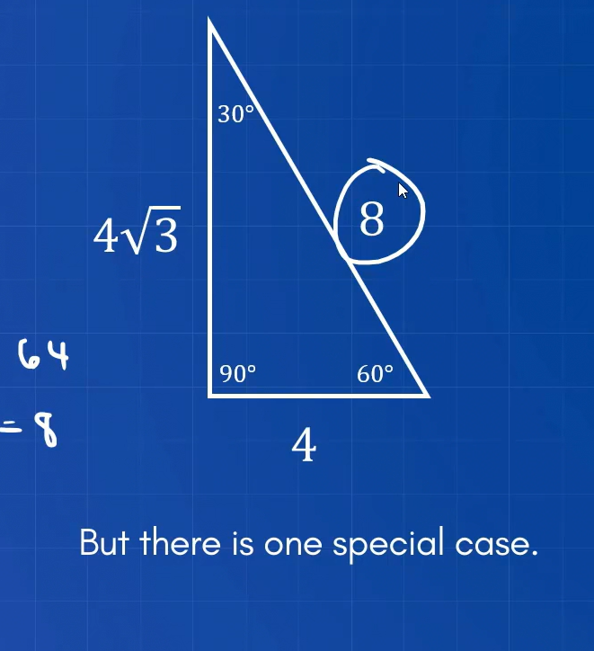
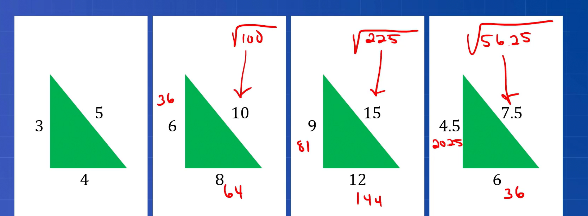

# Triangles

A polygon with three sides.

The side opposite to the largest angle is the largest side.  
The side length is directly proportional to the angle opposite to it in a triangle.

## Types

1. Right angled triangle
2. Equilateral triangle
3. Isosceles triangle
4. isosceles right angled triangle : triangle that has both the properties of isosceles and right angled triangle

The right angled triangle has the hypothenuse as the largest side.

**Pythagoras theorem** :

$$ a^2 + b^2 = c^2 $$

**Formula for right angled triangle**:

$$ \frac{1}{2} _ base _ height $$

If the triangle is right angled and both the non 90 degree angles are 45 degree then the hypotenuse is equal :

$$ h = S \sqrt{ 2 \phantom{\tiny{!}}} $$

S is the side of the triangle other than hypotenuse which are equal to each other.

If you are given a triangle with 45-45-90 triangle you can find the length of each side by dividing the hypotenuse by $\sqrt{2}$.

☝️ This is valid only for 30-60-90 triangle.

**Area of equilateral triangle** :

$$ A = half \cdot half \cdot \sqrt{ 3 \phantom{\tiny{!}}} $$

😫 Memorize this please :

The sum of exterior angles of triangle is equal to 360 degree.

The sum of angles of two sides of triangle is always equal to the exterior angle of the opposite side.
