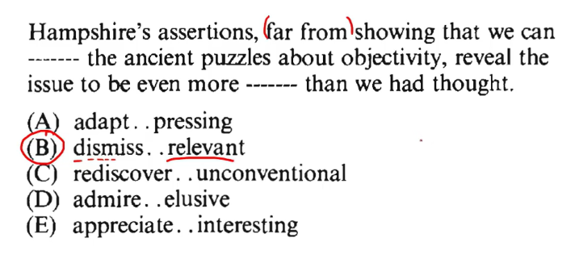

# Verbal

## Math Strategy

Either the sentence is support or contrast.

**Sentence** : + (positive)  
**Contrast** : - (negative)

Steps to solve a verbal question:

1. Destroy the options.
2. Support or Contrast.
3. Find the clue words.
4. Do the math.

## Contrast Words

- but
- though
- despite
- while
- even after
- though
- however
- whereas

## Support Words

- likewise
- if only
- not only
- since
- far too
- because
- but also
- ;

exacting = demanding, acerbic = bitter, copious = a lot, scathing = bitter, meticulous = exacting.

controversial = at issue, disputed, intensification = increase.

rife = general or common, activism = political, apathy = no emotion, affability = friendly, fortuitous = unexpected or lucky.

miserliness = stringy or unwilling to share.

frugality ( thrift ) = saving money and spending it carefully .

acolyte = follower, assistant.

disinterestedness = unbiased, impartial.
speciousness = misleading, deceptive.

pervasive = present everywhere or ubiquitous or omnipresent.

conformism = following the crowd.

fecklessness = worthless, irresponsible.

repugnance = repulsion, disgust.

dubious distinction = means that you don't have a complete honesty, reliability regarding something or thoughts not completely true.

feat = achievement.

muse = think about something carefully.

intriguing = interesting, fascinating.

antipathy = a strong feeling of disliking.

ubiquity = very common or appearing everywhere.

rudimentary = basic or elementary.

pedantry = being very concerned about small things.

skepticism = doubt, doubtfulness.  
skeptical = doubtful, dubious.

connoisseur = expert in judging something.

scourge = chabuk in hindi.

provision = supply something.

impunity = exemption from punishment.

propriety = correctness or decorum.

## Pairing Strategy

Usually two words are synonyms of each other, find that pair.

disseminate = spread, propagate synonym is promulgated.

immense = huge, enormous.

fortuitous = unexpected, lucky (serendipitous).

prescient = having knowledge of something before it happens ( foresighted ).

lucrative = producing wealth or profit.

blemishes = defect or imperfection.

pretension = claim, assertion.

revival = amelioration, improvement.

revere = respect, admire.

panacea = cure-all, universal remedy.

equivocal = ambiguous, vague.

arcane = mysterious, secret.

enigmatic = mysterious, puzzling.

mundane = dull or boring.

bucolic = rural, rustic, countryside.

opulent = luxurious, rich.

eclectic = varied, diverse.

irresolute = indecisive, uncertain, nervous.

sanguine = hopeful, confident

proliferate = increase rapidly, multiply.

run-of-the-mill = ordinary, average.

prolix = lengthy, wordy ( your easy is very prolix).

adroit = clever or skillful (He is very adroit).

unpretentious = modest, humble or straightforward.  
 murky = dark , dirty or difficult to see through.  
 chief impetus = main force.  
 obscure = not well known.  
 feeble = weak, frail.  
 bluntness = a person who say what he thinks without trying to be polite.  
 subtlety = dedicate, delicacy or difficult to understand.

subtle = not obvious, difficult to understand.

_In subtlety the b is silent._

lucidity = clearness, clarity.  
 unraveling = undo, resolve ( In the previous times things were unraveling).  
 notorious = famous for something bad.  
 debacle = disaster, fiasco, calamity.  
 amiable = friendly, pleasant.  
 sullen = bad-tempered, sour, depressed mood.

_sullen is the synonym of surly._

surly = bad-tempered, rude.  
prudent = careful & avoiding risks or person with good judgement.  
frown = sad, depressed.  
dubious = doubtful, uncertain.  
contending = competing, fighting, cope with, deal with (I am trying to contend the fear of exams in my life) jockey.  
irrefutable = undeniable, cannot be disproved.
acerbic = when someone say something direct in a cruel or bitter way to heart someone.  
innocuous = harmless, not offensive.  
voluble = very talkative, loquacious prolixity.  
prosper = flourish, grow strong.  
scuffle = fight, brawl, struggle.  
crumble = break into small pieces, disintegrate, fall into pieces.  
vindicate = clear someone of blame or suspicion.  
apocryphal = doubtful, dubious, not true.  
bizarre = strange, odd.  
mortified = humiliated, embarrassed.  
incensed = very angry, enraged.  
coalescing around = come together, unite ( at the time of calamity family coalescing around)  
iconoclastic = criticizing beliefs and institutions.  
doctrinaire = dogmatic, rigid or inflexible.

> dogmatic is synonym of doctrinaire.

heterodox = unorthodox, not believing in the usual beliefs or standards.

> heterodox is some what similar to iconoclastic.

orthodox = traditional, normal, strict.  
sporadic = irregular, occasionally.  
scanty = limited or meagre or restricted.  
aloof = removed or distant either physically or emotionally ( I am aloof right now).  
placid = clam or peaceful ( Before giving exam the mind should be placid).  
restive = unwilling to be controlled or restless.

> restive is a synonym of skittish.

> tranquil is a synonym of placid.

vociferous = when people express their opinions and complaints loudly and repeatedly in speech, shouting. (After the exam students were vociferous about the difficulty level of the exam)

shore up = support, strengthen.

indecorous = improper, unseemly, inappropriate.

> indecorous is a synonym of unseemly.

exacerbate = make worse, aggravate.

> outmoded is synonym of obsolete.

> Very very important thing to remember _major breakthrough_ means advancement or progress.

disparate = different, dissimilar.

> disparate is a synonym of divergent.

quotidian = ordinary, occurring daily.

stingy = mean or ungenerous.

## GRE words as groups

frugal = economical, thirfty, a person who spend very very carefully (baniya).

cursory = not detailed, quick, hasty, perfunctory, desultory, halfhearted.  
capricious = fickle, mercurial, vacillating.  
hum-drum = mundane, boring, dull, dreary, monotonous.  
congenial = amiable, convivial, hospitable, friendly.  
austere = strict, stark, ascetic, severe, spartan.  
wary = cautious, careful, circumspect, chary, heedful.  
puerile = infantile, juvenile, jejune.  
taciturn = reserved, reticent, laconic, aloof.  
loquacious = verbose, voluble, garrulous, very talkative.  
feasible = practicable, expedient, conceivable.  
zealous = fervent, ardent, showing a great enthusiasm/energy in pursuit of a cause or objective.  
prolix = long-winded, verbose, wordy.  
explicit = clear and exact.  
Verisimilitude = appearance of being true.  
avaricious = greedy, acquisitive.  
pertinacious = determined, persistent.  
court = woo, chase, pursue, seek the favour or support.  
moviegoer = cinephile, someone who likes to watch movies.  
sinister = evil, dangerous.  
seldom = only few , occasionally.-
susceptible = vulnerable, sensitive.  
scornful = arrogant, contemptuous, disdainful.  
contemptuous = feeling or expressing deep hatred or disapproval.  
alacritty = cheerful, eagerness, enthusiasm.  
demur = raise objection & show reluctance.  
efficacious = successful or effective.  
evident = clear , obvious.  
derisive = mocking, teasing.  
reprimand = scold, criticize.  
burgeon = flourish, grow.

> desultory is a synonym of cursory.

resilient = strong, tough, flexible.

## Piece method

In this method we just divide the statements into various peices.

### Steps

1. Identify division.
2. Break down the sentence into peices.
3. Apply the logic into it.

**Well known division words** :

1. make ( It is a verb so please be careful with the ambiquity here)
2.

denigrating = badnamm karna in hindi.  
epitome : perfect example of somthing.  
endorsement : support or approval.  
censure : criticize harshly or disapproval.  
dissolution : disintegrate or break into pieces or unstable.  
contemporary : modern or current.  
subside : become less intense or violent.  
appease : khush in hinglish.  
berate : scold or criticize someone angrily.  
condone : accept and allow.  
impugned : challenged or questioned.
contrary : opposite or against.  
salutary : beneficial or good effects.  
debilitating : make someone weak and infirm or tending to weaken something.  
reinforce : bolster up , strengthen.  
unglamorous : lacking attractiveness or glamour.
