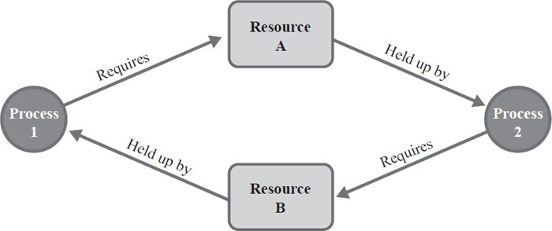

# Deadlock

If two processes are waiting for happening of an event but that event , but say that event does not happen then those processes are said to be in a deadlock .

## Necessary Conditions for Deadlock

1. Mutual Exclusion
   1. All resource that the processes are using must be used in a mutually exclusive manner i.e. one by one , intermediate leaving is not allowed .
2. No-preemption
   1. No preemption of resources, when another process requests for the resource.
3. Hold & Wait
   1. If a resource is allocated to a processes then the processes should hold that resource until the process is done executing.
4. Circular Wait

   

## Methods of handling the deadlock

1. **Prevent or avoid deadlock**

   Ensuring at least one deadlock necessary condition for deadlock cannot hold.

   1. Implementing mutual exclusion for only those resources which are non-sharable.
   2. Each process has to request and allocated all its resources before its execution, allow a process to request a resource when it has none.
   3. To prevent circular weight condition we can impose a proper ordering of resource allocation.

   Avoidance

   Safe state : A state is a safe state if system can allocate resources to each process in some order and still avoid DL.

   A system is in safe state if their exist a safe sequence.

   Unsafe state : If there exist no sequence of process from which deadlock wont occur.

   Banker’s algorithm is used to detect weather the system is in safe state or not,

   It also given the sequence of the safe state in order to avoid deadlock.

2. Allow the system to go in deadlock

   detect the deadlock and recover from it.

   1. Algorithm i.e. Banker’s algorithm
   2. if DL exist → step 3.
   3. recover from it
   4. else step 1.

## Resource allocation graph

It is the pictorial representation of the state of the system, it has all the information about the system about resource allocation to each process and request of each process

It has

1. Vertices and edges : vertices represents the process or resources and edges represents the allocation or request for resource.
2. Process is represented by circle where as resource is represented by rectangle.

Resources :

1. Single instance : It contains single instance of the resource and is represented by a single dot inside the rectangle.
2. Multiple instance : it contains multiple instance of the resource and is represented by more than one dot in the rectangle.

## Semaphores

1. Binary Semaphores :

   Solution to Critical Section Problem .

   ```cpp
   Some code...
   P(S).
   CS...
   V(S).
   Some code...
   ```

   P(S) → Wait , Sleep Down.

   V(S) → Signal , Wait , Up.

2. Counting Semaphores :

   Semaphore value is equal to how many instances of the resources can be made.

   Instances of the resources i.e. how many processes the resource can handle concurrently.

   [https://youtu.be/-oRdvw8qsBo](https://youtu.be/-oRdvw8qsBo)

Used when a single resource have multiple instances.

if cycle is present in the RAG then this does not mean that Deadlock is also present the the system.

## Producer consumer problem

Two different entities in the system one is the producer and other is the consumer.

Classic problem

Critical section is Buffer.

Producer :

Tends to add chunk of data into the buffer.

Consumer :

Tends to remove the data from the buffer.

Problems :

1. Synchronization between Producer and Consumer .
2. Producer should not add value if the buffer is full.
3. Consumer should not remove value from the buffer when the buffer is empty.

Solution :

Semaphores

1. m , mutex : Binary semaphore used to acquire lock on the buffer.
2. empty : A counting semaphore, for counting the empty places in buffer, its initial value is n ( Tracks empty slots ).
3. fill : Tracks filled slots , initial value is 0 .

```cpp
Producer :
do {
 wait(empty); // wait until empty > 0 then , empty => value
 wait(mutux); // accquire lock on buffer.
CS....
signal(mutex);
signal(full); // increment the full counter.
} while(1)

Consumer :
do {
wait(full); // wait until full > 0
wait(mutex);
CS...
signal(mutex);
signal(empty); // increment empty
```

## Reader writer problem

Reader threads : for reading purpose

Writer threads : for write/update purpose

If Reader count > 1 then

No problem

if Writer count > 1 && some other ( R/W ) operation is taking place

Race condition may occur

Solution :

1. mutex → Binary semaphore , to ensure mutual exclusion , when read count is updated.
2. wrt → Binary semaphore , common for both reader and writer.
3. read count → Integer { 0 } , tracks how many trackers are reading cu

Writer solution →

```cpp
do {
wait(wrt);
// do write operation
signal(wrt);
}while(1);
```

Reader solution →

```cpp
do {
wait(mutex); // to mutext the eread count
rc++;
if(rc == 1)
	wait(wrt); // ensure that no writer can enter if there is even one reader
	signal(mutex);
CS......reader is reading
wait(mutex)
rc--;
if(rc == 0)
	signal(wrt);
signal(mutex);
cs....
wait(mutex);
rc--;
if(rc == 0) // no reader is left in the critical section
	signal(wrt);
signal(mutex);
} while(1);

```
