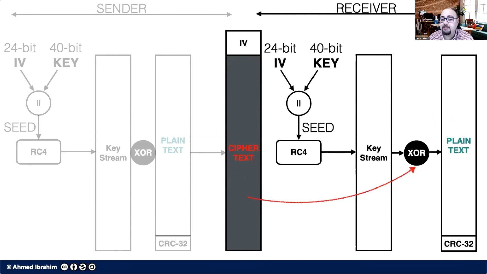

# Security OS

Security in OS, refers to the measures and practice taken to protect the operating
running on the computer system.  
It is very critical to maintain the security of the operating systems because,
it is the foundation of all the softwares and programs
running and once the OS is compromised then attacker has access to each and every data of the computer owner. 

## Port scanning

Ports are the communication end-points through which the computer communicate
with the outside network, each port is associated with a
specific protocol.  
Attacker always moniter the network for open ports and services
running on the specific port number, once a vulnerable port is choosen
by the hacker then the hacker is ready to launch the attackes.  
This technique is also used by security professionals to test
the security of the computer system's network
looking for vulnerable port number and services running on them
to prevent them from getting exploited.

## Network Intrusion or MITM attack

In this attack attacker try to interfare with the user's or organization network
may eavesdrops the network and spoof any request and response
comming from the devices, In this attack
sender believes that response is comming from the legitimate receiver
but instead the response has been modified by the attacker.

These types of attacks usually occurs in public areas like cafes,
malls, restaurants, etc.  
$\color{#fd5c63}{Prevention :}$

1. By using HTTPs instead of HTTP.
2. Network segmentation or isolation.
3. By implementing DNS security.
4. Keeping softwares up to dates.
5. Using VPN's when connecting with organizations.

### Rootkits

It is a malicious software or collections of software
perform malcious activities which may or may not require root access to the computer systems, these are hidden deep within the Operating system, It might gets hidden in the kernal of the Operating system. 
Allow attacker to gain control over the entire operating
system without knowledge of user.

**Consequences** :

1. Infect device with malwares.
2. Initiate DDOS attack.
3. Disable anti-virus softwares.
4. Take admin rights over the device.
5. Can delete files or event corrupt entire disk.
6. Can also injects some backdoors and keyloggers.

#### How rootkits work

- Rootkit do not spread themselves, attacker uses
  clandestine methods to inject it in the computer system,
  ususally rookkit applications asks for root permission over the device.
- Some times rootkits appreas to be a useful software for
  the operating system but underneath performs malicious activities.
- Rootkit can also destory the boot sectors of a hard drive,
  preventing user from booting the operating system.

#### Types of rootkits

**User level** :

- Also known as application rootkit.
- **Execution** : It may executes in a same way as
  the normal computer application do, do not have direct
  access to the computer hardware resources.
- **Installation** : They do not require administrative
  privileges while installation can install with only standard permissions.
- **Removal** : It is easier to detect and remove User level root kits.
- **Detection** : Can be easily detected by antivirus softwares or even normal users.

**Kernal level** :

- **Execution** : It executes in the deepest level of the operating
  system ( kernel ), has unrestricted access to the hardware and as well as the
  software of computer system.
- **Installation** : They must require administrative privileges
  before installtion, as they need access to kernal.
- **Removal** : Removal of this type of rootkit is challenging even for
  most of the anti-virus softwares today.
- **Detection** : Can not be easily detected by user or anti-virus
  because of limited visibility.

#### Bootkit

It is a type of malicious software that affect the master boot
record.  
Bootloader is the first program which runs when the program
starts whose main function is the load the operating system
in the main memory.

### Prevention from rootkit

1. **Keep the softwares up to date** : Regular updates are necessary for latest
   security patches.
2. **Secure Boot** : It is important security meachanism to prevent malicious
   softwares from loading.
3. **Trusted sources** : Always rely on trusted websites or stores before
   downloading something.
4. **Take Reguar Backups**
5. **Analysis suspicious behavior** : Notice, anything unusual in the computer system.

## Network security attacks

These attack are usually performed by the cybercriminals to
destroy the Confidentiality, Integrity, Authenticity of
the network system.  
These attacks can exploit the vulnerabilities in the network systems, devices.
Here are some common types of network attacks.

1. **DOS ( Denial of service attack )** : Multiple false request are made to
   the server in order to crash to web server, thus
   losing its ability to entertain legitimate users.
2. **Packet Spoofing** : In this type of technique used in the network attacks where
   source address of the packet is maniputated, attacker then send spoofed packets
   to trusted communicating entities.
3. **Zero Day Vulnerabilities** : Those softwares or programs which has a
   vulnerability but that vulnerability is not known to the vendor
   of the software yet or vendor has no official patch for that vulnerability.
4. **SQL-Injection** : Attacker directly target the database of the web-sever,
   main aim is too get direct access to the database.
5. **MITM attack** : Attacker tries to interfare and modify the commnunication
   happening between two endpoints in a network system.

$\color{#fd5c63}{Prevention : }$

1. Firewalls.
2. Encryption of data transmitted over the network to prevent the
   confidentiality
   of the data transmitted over the network.
3. **Network segmentation** : Dividing a larger network into smaller
   sub-networks, as maintaining and securing a smaller network is easir
   than a larger network.
4. Installing Anti-virus softwares.

### Wireless security

Wireless security are the mesasures and protocols to implemented to to
protect wireless network from unauthorized access and stealing the data.  
Though the information is encrypte but anyone can access that information
if good authentication is not implemented.

#### WEP protocol

Wired Equivalent Privacy\*\*

- It is the eariliest security protocol.
- It was first introduced to provide confidentiality to the data.
- It uses 40 bit encryption key for encrypting the data
  along with a 24 bit initialization vector to generate the seed.
- Initialization vector is sent with the cipher text to the destination
- All traffic in this protocol uses same static key.
- The encryption algorithm used is every weak which is RC4 encryption.

#### WPA protocol

Wifi protected access

- It is better security protocol then WEP.
- It uses stronger encryption protocol like Temporial key Integrity
  Protocol(TKIP).
- Uses dynamically generated key, which are different and unique for
  each packet inside the network.
- Prevents attacker from creating their own encryption key
  to match the one used to secure the network packets.
- Uses MIC (Message Integrity Check) to make sure that attacker has not altered
  the packets of the network.

WPA 2 :

Provides stronger provides even stronger encryption algorithm then WPA.
Uses Advanced Encryption Standard.  
WPA 2 is designed to be backward compatible with WPA by introducing
combination of TKIP + Avanced Encryption Standards.

WPA 3 :

- It is the most latest wireless protcol used today.
- It used most secure ways to simplify the network security and enable
  most robust authentication.
- Uses the most secure authentication called SAE (Simultaneous
  Authentication of Equals).
- It is resistant to all brute force and password guessing attacks.
- Also comes with the backward compatibility with previous versions of WPA's.
  Uses _DPP(Device Provisioning Protocol)_ which allows users to share the wifi
  key using OR codes and NFC's.

## DOS

In this type of attack, the attacker send multiple overwehlming request
to the targeted victim computer systems or web-server to make them
resources busy in handling thoese requests and prevent the legitimate
users from accessing the web-servers.  
Compromise the availability of the victims device.  
Multiple overwhelming requests are sent from only one device.

## DDOS

It is the similar to DOS attack but the request comming to the victim are from
multiple different devices rather than one single devices, usually performed
by botnets compromised by cybercriminals.  
Target of this attack is usually a web-servers of an organization.

### Difference between DOS and DDOS attack

| DOS                                                                        | DDOS                                                                       |
| -------------------------------------------------------------------------- | -------------------------------------------------------------------------- |
| Denial of service attack.                                                  | Distributed Denial of service attack.                                      |
| In DOS a single system is targeted.                                        | In DDOS multiple systems or a web-servers are targeted.                    |
| Victim's machine is over loaded with packets sent from a single system.    | Victim's machine is over loaded with packets sent from multiple locations. |
| Can be prevented easily, since packets are comming from only one location. | Harder to prevent since packets are comming from different IP addresses.   |
| Easily traceable                                                           | Difficult to trace                                                         |
